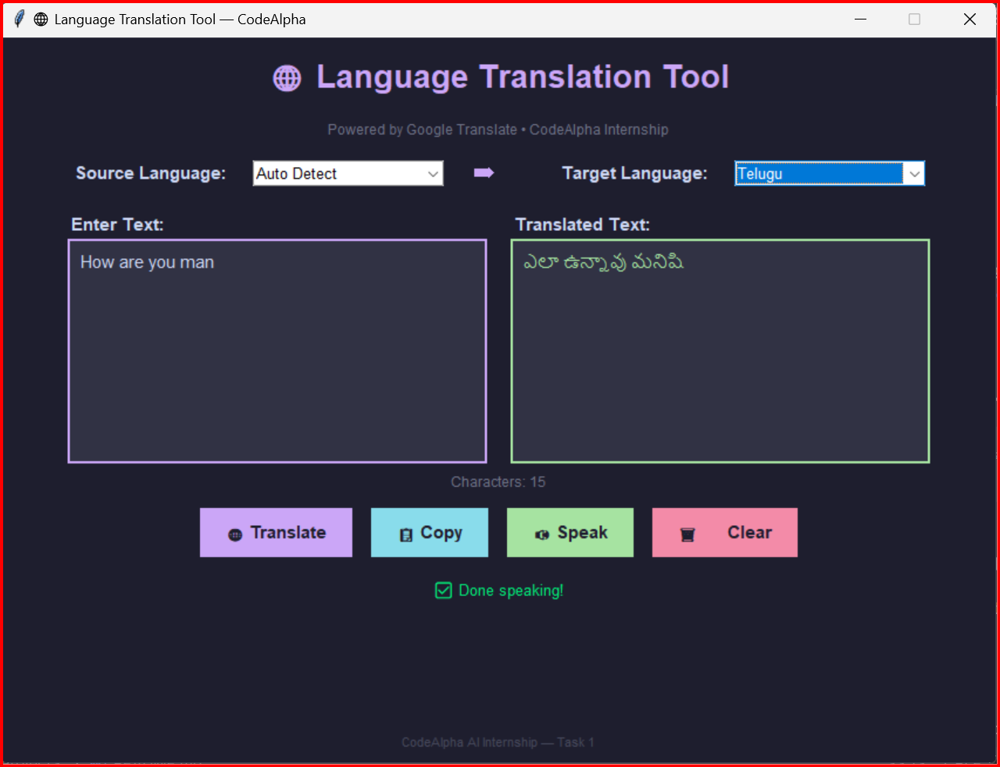

# 🌐 Language Translation Tool

### CodeAlpha AI Internship — Task 1

## 📌 Description
A desktop Language Translation Tool built with Python and Tkinter.
Supports 20+ languages powered by Google Translate API.

## ✨ Features
- Translate between 20+ languages
- Auto language detection
- Text-to-Speech (Speak button)
- Copy to clipboard
- Clean modern dark UI

## 🛠️ Tech Stack
- Python 3.13
- Tkinter (UI)
- deep-translator (Google Translate)
- pyttsx3 (Text to Speech)
- pyperclip (Clipboard)

## ▶️ How to Run
```bash
pip install deep-translator pyttsx3 pyperclip
python translator.py
```

## 📸 Screenshot


## 👨‍💻 Author
Madhav Gorla — CodeAlpha AI Internship